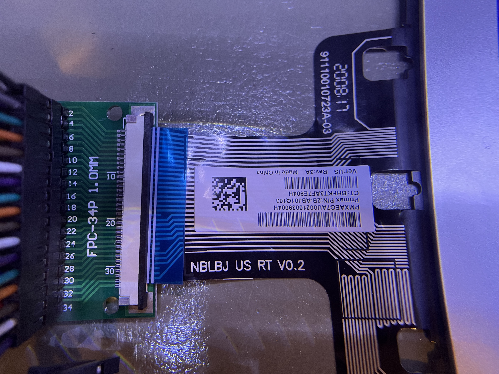
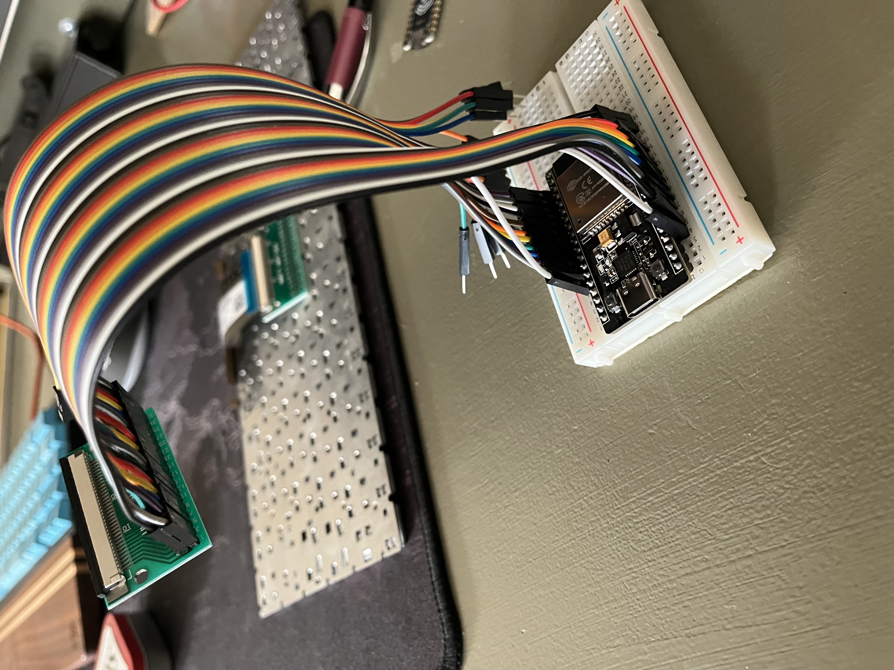

# Keyboard matrix generator

I found this laptop keyboard (Model: NBLBJ US RT V0.2) in an e-waste bin and decided to make use of it. The first step is to figure out the keyboard matrix by scanning with an MCU. The connector is a 32P 1mm FPC. I was only able to find 34P female connectors on aliexpress. But the alignment seemed OK. I was able to use 32 out of the 34 pins.



The next step is to figure out the matrix. These keyboards are usually extremely simple. There are a few "columns" and a few "rows". Note that I am using quotes to refer to columns and rows, because they have no relation to the physical layout. They are completely conceptual. Each column or row is connected to a pin. When a key is pressed, one column and one row are connected. Unlike typical mechanical keyboards, these keyboards don't have diodes. They could potentially report wrong key presses when multiple keys are pressed at the same time. But such issues are usually mitigated by strategically assign the columns and rows. The circuit is printed on just one layer. So the traces cannot cross each other. These two factors result in a rather sparse matrix. I.e. many column and row combinations don't correspond to a key.

To decode the matrix (i.e. which key corresponds to which column and row), I used a WROOM ESP32 chip to revserse engineer it semi programmatically. The end goal is to figure out:

* Which pins are columns
* Which pins are rows
* Which pins are unused
* The column and row of each key

The idea is pretty simple. Initially, we assume every pin could be a column and every pin could be a row. For each potential column, we
* Put that pin in output mode.
* Put each other pin in pulldown input mode. I.e. its status is low unless it's being pulled up by an external input.
* Set the column pin to high.
* Read each other pin. If it's high, it means a key is pressed to connect that column and that row.

And we iterate through each potential column, and put this whole logic in an inifite loop. Then we just need to press each key to find out the matrix assignment. One big caveat is that, I don't have an MCU with 32 available GPIO pins. It's clearly visible that these pins are not connected to anything: 19, 25, 26, 30, and 31. But there's still not enough GPIO pins for the rest 27. So I needed to shuffle a couple of times. I.e. I left some pins empty, ran the scanner to figure out some keys, then rorate the pins to figure out more, until all keys were assigned. In practice, I also used a multimeter to narrow down a few keys. Once I have figured out the two pins corresponding to each key, I put them in two groups, columns and rows, such that all the connections are between the groups but not within. Essentially, it's a [bipartite graph](https://en.wikipedia.org/wiki/Bipartite_graph).




I used a [WROOM ESP32](https://www.espressif.com/en/products/modules/esp32). But pretty much any MCU will do. The more pins, the easier it is. And here's the end results:

Columns:  
```
Col #: 0 1 2 3 4 5 6 7  
Pin #: 1 2 3 5 6 8 9 12
```

Rows:  
```
Row #:  0  1  2  3  4  5  6  7  8  9 10 11 12 13 14  
Pin #:  4  7 10 11 13 14 16 17 18 20 21 22 23 24 15
```

In total, there are 23 pins used for the matrix. The rest of the pins are either not used or for the capslock indicator. I couldn't figure out the pins for the indicator despite having tried all the combinations using a multimeter. It might be broken.

```
   |   0   |   1   |   2   |   3   |   4   |   5   |   6   |   7   |
---+-------+-------+-------+-------+-------+-------+-------+-------+
 0 |       | RShft |       |       | LShft |       |       |       |
 1 |       |       |       | RCtrl |       | LCtrl |       |       |
 2 | F7    | W     | 2     | S     | X     | F6    | F5    | F8    |
 3 | ESC   | Q     | 1     | A     | Z     | Tab   | ~     | Caps  |
 4 | F4    | E     | 3     | D     | C     | F3    | F2    | F1    |
 5 | G     | R     | 4     | F     | V     | T     | 5     | B     |
 6 | H     | U     | 7     | J     | M     | Y     | 6     | N     |
 7 |       | I     | 8     | K     | ,     | ]     |       |       |
 8 | Win   |       |       |       |       |       |       |       |
 9 |       |       | LAlt  |       |       |       |       | RAlt  |
10 | BkSpc | Up    | Down  | Entr  | Spc   |       | \     | PrtSc |
11 | F11   | O     | 9     | L     | .     | F10   | F9    | F12   |
12 | '     | P     | 0     | ;     | /     | [     | -     | =     |
13 | INS   | Left  | Right | PgDn  | End   | Home  | PgUp  | Del   |
14 |       |       |       |       |       |       | Fn    |       |    
---+-------+-------+-------+-------+-------+-------+-------+-------+
```

The next step is to hook it up with an MCU and run QMK on it. I happen to have a spare Elite-C which has 24 exposed pins, perfect for this job.