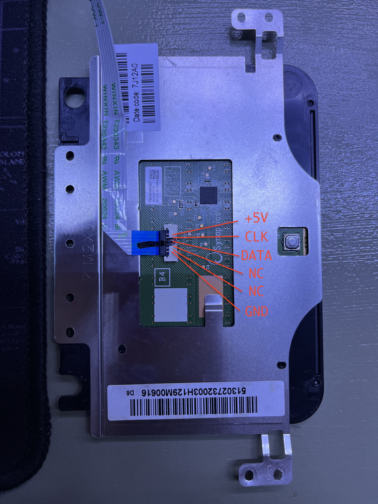

# Laptop Touchpad Project

This is the first step of this project.

## Goal

Turn this touchpad into a mouse that supports:
* Regular mouse functionalities. I.e. cursor movements, left and right clicks.
* Two-finger scrolling.
* Optionally: two finder click as right click.
* Optionally: tap as click.

The first goal is very straight-forward. And here's the implementation with Arduino framework.

Touchpad info

* Pulled from an HP Envy Sleekbook 6
* Synaptics chip # T1320A
* Physical pinout


More info obtained from programatic querys:

* Query 0x00: 01 47 18
```
Version 8.1
```

* Query 0x01: 20 87 40
```
Model 0x0887
```

* Query 0x02: D0 01 23
```
Model sub number: 01
Middle button: no
Pass through: no
Low power: no
Multi finger report: yes
Multi finger detect: yes
Can sleep: no
Palm detect: yes
```

Packet formats

Relative mode (mouse compatible)
```
   | 7 | 6 | 5 | 4 | 3 | 2 | 1 | 0 |
(1)| Yo| Xo| Ys| Xs| 1 | M | R | L |
(2)|               X               |
(3)|               Y               |
```